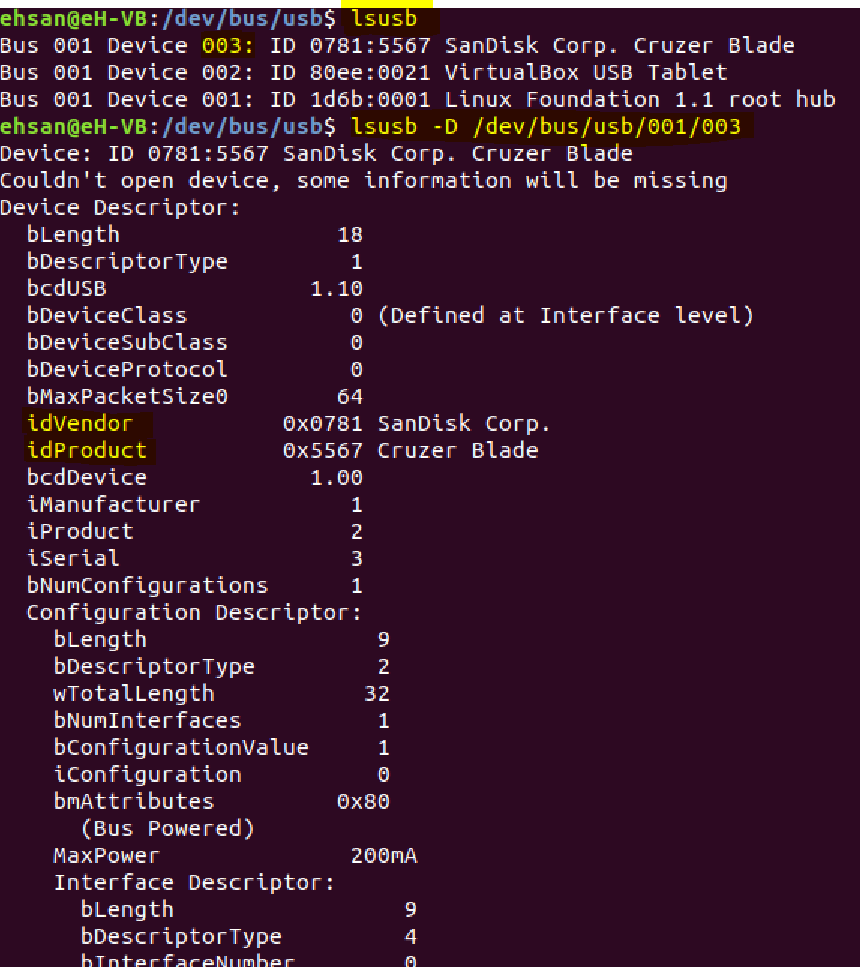

## Tasks:
Write a Linux service that starts when a USB drive is inserted and implements the following

* clean up files until a configurable amount of free space is available
* clean up by age, delete the oldest files first
* also trigger a cleanup every 5th minute
* Instantly trigger cleanup if drive usage goes above 80%

Use Python for scripting

## Read usb via linux service
- To read all the devices on Linux use `lsusb` to find Device id
- to read `idVendor` and `idProduct` use  `lsusb -D /dev/bus/usb/001/<Device id>`

## OR
- Use `sudo blkid | grep /dev/sd` to see all usb disks.
## How to run it

1. Install python3 and pip3 followed by `sudo pip3 install pyusb`
2. Copy the python code `usb_scan.py` into `/usr/local/bin/`
3. Copy the `usb_scan.service` into `/lib/systemd/system/`
4. Reload the systemctl daemon to read new file. You need to reload this deamon each time after making any changes in in .service file. `$ sudo systemctl daemon-reload`
5. Now enable and start your new service
`$ sudo systemctl enable usb_scan.service`
`$ sudo systemctl start usb_scan.service`
6. For service status: `$ sudo systemctl status usb_scan.service`
